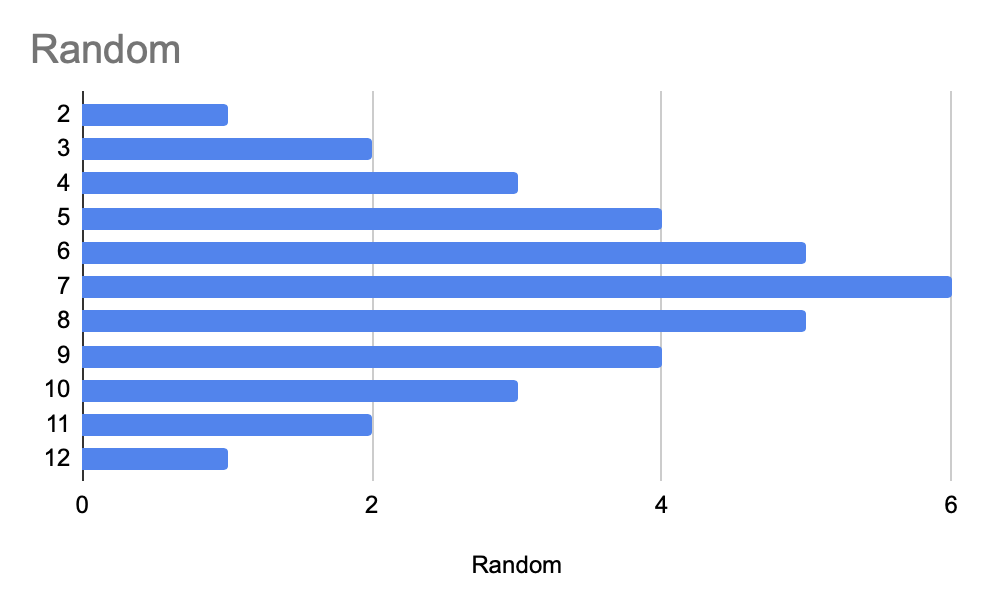

# ^ The Truth About Dice Control

### Why

The divide between the pro and anti dice control/influence crowds seems to be widening and the discussions both online and at the tables escalates quickly. For no good reason. 

There exists a faction of absolutists that will state unequivocally "It's not possible" ... it'd be fine if they left it there, but they never do.

There exists a faction of absolutists that will state unequivocally "It's not only possible, I can prove it. I have software to sell you, and if you drop me a check and come to my camp, I can change your life"

Stating the obvious, both factions are cults.

I'm a believer. I've got a child-like faith in God. Some of my best friends are Athiests. That doesn't make them assholes, and it doesn't make me a science denier. It makes us disagree and it also brings us into some killer discussions about things we're both passionate about.

Let's live in the grey for a minute and examine what Dice Influence actually is, what it isn't, how it works and maybe there can be a little bit more agreeing to disagree 

Reddit Post:

_I'm trying to bring the 2 cults here to the middle. We have Moses coming down from on high every time the words Dice Control are mentioned stating the "Fact" that it's an impossibility and we're all lemmings and dumbasses. There's an equally cultish group on the other side literally taking the role of the snake in the garden telling us \(for a feee, of course\) that the apple is totally fine..._

_What I'm doing is to try and showcase the 3 theories with slow motion breakdowns to prove the following theories:_

1. _Random is Random and over time will nearly exactly fit the probability chart_
2. _"On Axis" Dice Control is basically impossible. Slo-Mo will show that especially on neoprene and newer tables, there's so much sidespin and randomness that you cannot claim to be exerting control, but might effect the probabilities a little bit._
3. _"Controlled Shooting" where you focus primarily on the energy and speed coming off the diamonds will definitely change the appearance of the 7, but the ratio of the other numbers won't likely change much \(i.e. no 'control' of the numbers other than the 7 coming less\)_
4. _In cases 2 and 3, if you are "perfect" and throw the same dice set consistently, you will see a difference in the probability chart_

_This will be a bunch of theory, a lot of looking at slow-mo to prove and disprove and see what the table actually does to the dice. I'm backing up the theory and slow-mo with 10,000 rolls of each type and showing raw probability stats \(not in-roll counts like hands won, etc\). Hoping that this leads to the 2 cults coming to the thanksgiving table._

_It takes FOREVER to film and roll this stuff out. I think the effort is worth it. I can easily say already that \#1,2,3 are all true. And when I say true, it's very minute. But minute can make a difference. If you can change the probability chart by throwing softly from having the 7 come 1/7 instead of 1/6 that's huge._

_Do the casinos care? Hell no. 99.99% of the people just throw randomly into the probabilities. the other .01% of people that think they can exert control might win more often than a random shooter, but they bet like idiots and hand it all back when their toss goes to shit, which inevitably happens. The unicorn that can throw and has discipline ... there's about 5 of them on the planet._

### What

Let's get some definitions and expectations out of the way and focus on things we know to be true.

**Every throw is random. Period.**

1. The diamonds ensure it
2. The bouncy tables ensure it
3. Having chips all over the table ensures it

**The ability of humans to control elements of the shot is also real. Period.**

* Were it not, there would be no diamonds or bouncy tables
* Were it not, physics would be a lie and we'd all by hurtling through space
* ... and the Casinos don't care because the vast majority of us are pretty terrible at it
* Dice controllers come in a variety of skill levels, which guides how we frame this conversation

### **Dice "Control"**

There are a few out there that claim to be sharpshooters. Maybe one or 2 people in the world can actually call a shot and hit it. Sometimes. But this is a BS claim made by snake oil salesmen. Nobody can truly exert actual control over the dice.

With practice, you can "influence" the dice is subtle ways. Perhaps enough to change the predictability chart in ways that will allow you make more informed bets and employ strategies that work to your personal trends.  For example, with a given set, I tend to throw less overall 7s and horn numbers, and more than expected inside numbers.  Knowing your number clusters is a game changer, if your analysis is accurate.

Although I do keep a lifelong tally \(as shown below\), this starts to feel like how the casinos do it over time. In reality, we don't play over time, we play in short bursts where the fluctuations are more intense, so I fixate on small sessions \(36 2 or 3 times\) so see that I'm within the margin of error 

### **The appearance of the 7 & roll length**

We tend to get fixated on how often the 7 rolls. Remember, that rolling a 7 isn't always bad. What's a more important metric is roll length. That's where we're all making the majority of our bets, during a roll. Most dice controllers actually throw random on the comeout, which can skew the statistics.

**Pure Random**

When purely rolling random, the average over time is, in fact, that the 7 comes every 6 rolls or so. The key thing there is "over time" ... and thousands of rolls.

Randomly rolling what you find is the vast majority of your throws are 2 - 4 shots long with the occasional 20+ that's in there just often enough to make the average perfect.

The casinos know this, and because they never close, and there are billions of rolls, the house edge keeps the lights on.

**Bad or Beginning Dice Influencers**

I was here forever. You do backflips if you can get a point to go past 7. 90% of the time, you set the dice for a result and because you suck, you throw way more 7s. Worse than random.

For a long time, I was squarely in the "Dice Control is BS" camp, and then I saw exactly how many more 7s I was getting because of bad technique.

After thousands of rolls, not only was I consistently seeing the 7 an average of every 4 rolls, I was consistently seeing it every 3-4 rolls, almost like clockwork. An occasional 7 or 9 of course, but never the big ones I was seeing with pure random.

I was influencing the dice, very poorly, but very predictably, which meant I could bet accordingly.

**Dice Influence**

The thing about dice influence is simply an improvement on the above. At least for me, it's not about throwing 20 every time or upping my average to 8 or whatever the books and videos are selling. That is largely BS.

For me, it's about being at 5 or 6 or 7 rolls before the 7 all the time. I rarely if ever experience the 2-3 rolls and out thing anymore. I'm 80% of the time right at a 6, with the occasional 10+. I'm also more on the box \#s when throwing well.

This means, my betting strategy can change a bit when I have the dice allowing a little bit more aggressiveness over very short runs where I'm confident my mechanics are ok. When the mechanics are bad? Horn numbers start showing and the 7 trails it. Like clockwork.

**Dice Control**

I'm not a believer in dice control. There's an element of randomness in every throw. Dice influencers on a perfect throw can mitigate a lot of it \(most of it\), but I do not believe that anyone can sharpshoot or blow 20+ rolls on command.

### Summary

KNOWING if you are bad at this or good at this informs how you bet so that you can adjust your exposure in terms of amount bet, when and how many presses, and when to pull back. It's just about information and using that information so you don't get whacked. It also adds a really fun element to the game, in my opinion.

With Random, you're always 1 roll away from getting thrashed. With any level of DI, you pretty much know when about that 7 is coming so you can duck.

### How

The premise behind dice influence is simple enough in theory, yet amazingly difficult in practice because every factor has to be perfect in order to "sharp shoot"

Each of these variable can change for each person, so long as that person is consistent

* The dice must be "set" according to the results you are looking for
  * Generally, this means numbers you don't want, go on the outsides \(hidden\)
* The dice must fly together at the same speed
* The dice must rotate backwards at the same speed
* The dice must approach the table at the same angle 
* The dice must land in the same spot on the table 
* The dice must land flat
  * Any bit askew and you are going to be random
* The dice should kiss the back wall and die in front of it

So what's going on with the slow motion videos that seem to disprove dice control? The dice always go all over the place? 

When the dice land, given the set and the variables above, physics dictates to what degree of random we will experience. And when radomization does happen, it happens in predictable ways. Given the set you choose, and the mistake you made in your throw, certain numbers will still not show. You may still hit that 7, but you'll also be more likely to stay in cluster when you don't

Depending on speed and angle, when you hit the back wall, the number of new revolutions and bounces is a result of those variables. Limit the contact/speed and you'll give the dice less revolutions to randomize themselves.

